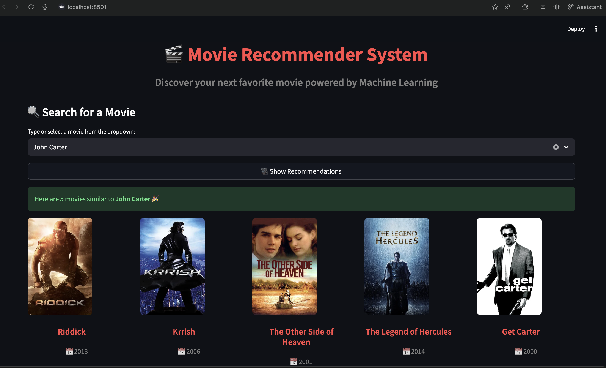

# 🎬 Movie Recommender System Using Machine Learning

A simple yet effective **content-based movie recommendation system** built with **Python** and **Streamlit**.  
It suggests movies similar to a user-selected title based on movie features and similarity scores.

---

## 🚀 Features
- 🔍 Search or select any movie title
- 🧠 Get top 5 similar movie recommendations
- 🎞️ Fetch posters dynamically from TMDB API
- ⭐ Displays release year and IMDb rating
- 💡 Built with a focus on *Machine Learning explainability*

---
# About this project:

This is a streamlit web application that can recommend various kinds of similar movies based on an user interest.
here is a demo,

* [Click here to run it live on server](https://movie-recommeder-system.herokuapp.com/)


# Demo:




# Dataset has been used:

* [Dataset link](https://www.kaggle.com/tmdb/tmdb-movie-metadata?select=tmdb_5000_movies.csv)

## 🧠 Theory Behind the Model

This project implements a **Content-Based Recommendation System**, which relies on the **similarity between movies** based on their metadata (e.g., genres, overview, cast, keywords).

### How it works:

1. **Feature Extraction**
   - From the movie dataset, important text-based columns such as:
     - `genres`
     - `overview`
     - `cast`
     - `crew`
     - `keywords`
   are combined into a single descriptive text field.

2. **Text Vectorization**
   - The combined movie descriptions are converted into numerical form using **TF-IDF (Term Frequency–Inverse Document Frequency)** or **CountVectorizer**.
   - This transforms each movie into a vector in high-dimensional space, where each dimension corresponds to a word’s importance.

3. **Similarity Computation**
   - Pairwise **cosine similarity** is calculated between these vectors.
   - Movies with higher cosine similarity scores are considered *more alike*.

   \[
   \text{cosine\_similarity}(A, B) = \frac{A \cdot B}{||A|| \, ||B||}
   \]

4. **Recommendation**
   - For a selected movie, the system retrieves the top N (here, 5) most similar movies based on similarity scores.
   - Posters, titles, and ratings are then displayed using TMDB API.

---

## 🧩 Tech Stack

| Component | Technology |
|------------|-------------|
| Frontend | Streamlit |
| Backend | Python |
| Model | Cosine Similarity + TF-IDF |
| Data Handling | Pandas |
| API | TMDB (for posters and metadata) |
| Storage | Pickle files (`movie_dict.pkl`, `similarity.pkl`) |

---

## ⚙️ Installation

```bash
# Clone the repository
git clone https://github.com/your-username/movie-recommender.git
cd movie-recommender

# Create virtual environment
python -m venv venv
source venv/bin/activate   # (use venv\Scripts\activate on Windows)

# Install dependencies
pip install -r requirements.txt

## Run the app

streamlit run app.py
